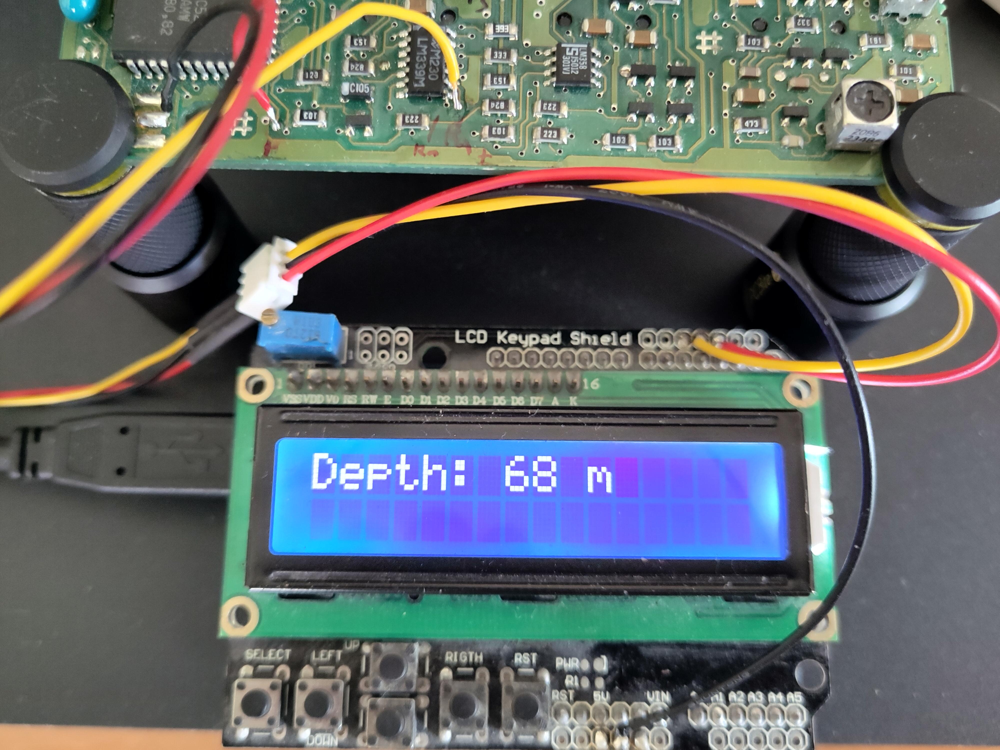

# ST30 Depth Transducer Mock (hack your ST30)
This repo mocks a Transducer on a real Raymarine/Autohelm ST30 circuit board, connecting an Arduino Uno with an LCD Keypad shield.

# Why
I work with some marine instruments which communicate via Seatalk or NMEA (see my other repos). At home I have some test equipment. Like this ST30. Unfortunately I have no transducer anymore. But for testing I needed to emulate some depth.

Luckily I came across this manual [AUTOHELM-ST-30-BIDATA-Schema-Circuits-imprimes (uchimata.fr)](https://www.uchimata.fr/wp-content/uploads/2014/10/AUTOHELM-ST-30-BIDATA-Schema-Circuits-imprimes.pdf). This helped me understanding where I could mock the transducer using a simple Arduino with an LCD and Keypad.

# How it works
## Echo sounder principle
The ST30 sends a pulse (ping) to the transducer. The transducer sends out the ultrasound ping. After the ping got reflected (pong) to the transducer, the transducer forwards the pong back to the ST30. Now the ST30 calculates the delay between ping and pong. With some *magic* the depth is calculated.

## Arduino mock
The Arduino is connected to both pins of the ST30: Ping and Pong. The Arduino receives the Ping (via Interrupt, timing is important here), waits the selected time, and then toggles the pong pin.

# How to connect
This is the neat part. The Controller on the ST30 works with 5 volts. So an Arduino is ideal for that. 

There are two pins (or three considering Gnd) needed to connect to the ST30: The "AGC PULSE" pin (ping, "TP65") and the pong pin ("TP87", comparator IC3c). 
Connect the Arduino Uno's Pin 2 to the "PULSE" and Pin 3 to the "DEPTH RX" pin. And don't forget to connect the Gnd pin!

See image above:

* Black: Gnd
* Red: Pulse "Ping"
* Yellow: Sound reflection "Pong"

# Limitations
## Depth limitation
I figured the maximum depth is around 175 meters. After that the previous pulse gets ignored. I guess that's just a ST30-related limitation (Ping went missing. Let's try another ping).

## Button reaction on big depths
The bigger the depth, the bigger the delay. When in the ISR (Interrupt Service Routine) the Arduino cannot execute the main loop and therefore not control the buttons.

Since this is only for testing, I won't optimize this code for that "problem". Quick Fix: Disconnect pulse pin before selecting depth
